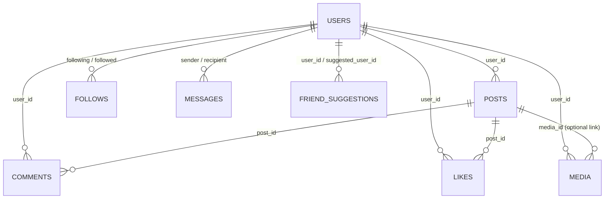

# Database Documentation

**Purpose:** Document the database schema for team reference.  
**DB Assumptions:** PostgreSQL 15+, UUID primary keys, `timestamptz`, optional Row Level Security (RLS).

---

## Overview of Database Architecture

The schema supports a social media application with core social and messaging features.

- **Users** – stores account information (auth root).
- **Posts** – post metadata (caption, timestamps, visibility).
- **Comments** – comments on posts.
- **Likes** – which user liked which post.
- **Followers** – directed “following” relationships between users.
- **Messages** – private direct messages between users.
- **Media** – media assets attached to posts or messages (image/video/text metadata).

**Design highlights**
- UUID primary keys; standardized timestamps (`created_at`, `updated_at`, optional `deleted_at` for soft-delete).
- Foreign keys with `ON DELETE CASCADE` to prevent orphan rows.
- Composite PKs on relationship tables (e.g., `likes`, `followers`) to enforce uniqueness.
- Enumerated domains via `CHECK` constraints (e.g., visibility, media kind).
- RLS-ready for user-owned resources (optional, can be enabled per table).

---

## Table-by-Table Documentation (It’s subject to change later.)

### 1. `users`
Stores account information for each user.

| Column      | Type      | Constraints                               | Description            |
|-------------|-----------|--------------------------------------------|------------------------|
| id          | integer   | **PK**, `GENERATED BY DEFAULT AS IDENTITY` | User id                |
| username    | varchar   | **UNIQUE**, **NOT NULL**                   | Public handle          |
| email       | varchar   | **UNIQUE**, **NOT NULL**                   | Login / contact email  |
| profile_pic | varchar   |                                            | Profile image URL      |
| created_at  | timestamp | **NOT NULL**, `DEFAULT now()`              | Creation time          |

---

### 2. `posts`
Handles post caption, timestamp, and visibility.

| Column     | Type      | Constraints                                                         | Description                    |
|------------|-----------|----------------------------------------------------------------------|--------------------------------|
| id         | integer   | **PK**, `GENERATED BY DEFAULT AS IDENTITY`                           | Post id                        |
| user_id    | integer   | **FK → users(id)** `ON DELETE CASCADE`, **NOT NULL**                 | Author                         |
| media_id   | integer   | **FK → media(id)** `ON DELETE SET NULL`                              | Attached media (optional)      |
| caption    | text      |                                                                      | Caption text                   |
| visibility | varchar   | `CHECK (visibility IN ('public','followers','private'))`             | Who can view                   |
| created_at | timestamp | **NOT NULL**, `DEFAULT now()`                                        | Created at                     |

**Indexes (recommended)**  
- `posts(user_id, created_at DESC)`  
- `posts(visibility)`

---

### 3. `comments`
Stores comments written on posts.

| Column     | Type      | Constraints                                               | Description   |
|------------|-----------|------------------------------------------------------------|---------------|
| id         | integer   | **PK**, `GENERATED BY DEFAULT AS IDENTITY`                 | Comment id    |
| post_id    | integer   | **FK → posts(id)** `ON DELETE CASCADE`, **NOT NULL**       | Target post   |
| user_id    | integer   | **FK → users(id)** `ON DELETE CASCADE`, **NOT NULL**       | Author        |
| content    | text      | **NOT NULL**                                              | Comment text  |
| created_at | timestamp | **NOT NULL**, `DEFAULT now()`                              | Created at    |

**Index (recommended)**  
- `comments(post_id, created_at)`

---

### 4. `likes`
Tracks which user liked which post.

| Column     | Type      | Constraints                                               | Description  |
|------------|-----------|------------------------------------------------------------|--------------|
| id         | integer   | **PK**, `GENERATED BY DEFAULT AS IDENTITY`                 | Like id      |
| post_id    | integer   | **FK → posts(id)** `ON DELETE CASCADE`, **NOT NULL**       | Post liked   |
| user_id    | integer   | **FK → users(id)** `ON DELETE CASCADE`, **NOT NULL**       | Liker        |
| created_at | timestamp | **NOT NULL**, `DEFAULT now()`                              | Liked at     |

**Uniqueness (recommended)**  
- `UNIQUE (post_id, user_id)` to prevent duplicate likes

**Index (recommended)**  
- `likes(post_id)`

---

### 5. `follows`
Manages “following” relationships between users (directed: follower → followee).

| Column            | Type      | Constraints                                         | Description            |
|-------------------|-----------|------------------------------------------------------|------------------------|
| following_user_id | integer   | **FK → users(id)** `ON DELETE CASCADE`, **NOT NULL** | Follower (who follows) |
| followed_user_id  | integer   | **FK → users(id)** `ON DELETE CASCADE`, **NOT NULL** | Followee (being followed) |
| created_at        | timestamp | **NOT NULL**, `DEFAULT now()`                        | Followed at            |

**Primary/Unique (recommended)**  
- `PRIMARY KEY (following_user_id, followed_user_id)`  
**Check (recommended)**  
- `CHECK (following_user_id <> followed_user_id)`

**Indexes (recommended)**  
- `follows(followed_user_id)`

---

### 6. `messages`
Handles private messages between users.

| Column       | Type      | Constraints                                               | Description       |
|--------------|-----------|------------------------------------------------------------|-------------------|
| id           | integer   | **PK**, `GENERATED BY DEFAULT AS IDENTITY`                 | Message id        |
| sender_id    | integer   | **FK → users(id)** `ON DELETE CASCADE`, **NOT NULL**       | Sender            |
| recipient_id | integer   | **FK → users(id)** `ON DELETE CASCADE`, **NOT NULL**       | Recipient         |
| content      | text      |                                                            | Message body      |
| created_at   | timestamp | **NOT NULL**, `DEFAULT now()`                              | Sent at           |

**Index (recommended)**  
- `messages(sender_id, recipient_id, created_at DESC)`

---

### 7. `media`
Stores user-created media (image/video/text) metadata.

| Column     | Type      | Constraints                                               | Description             |
|------------|-----------|------------------------------------------------------------|-------------------------|
| id         | integer   | **PK**, `GENERATED BY DEFAULT AS IDENTITY`                 | Media id                |
| user_id    | integer   | **FK → users(id)** `ON DELETE CASCADE`, **NOT NULL**       | Uploader                |
| url        | varchar   | **NOT NULL**                                              | Storage URL             |
| type       | varchar   |                                                           | Media type (`image`,`video`,`text`) |
| description| text      |                                                           | Optional description    |
| created_at | timestamp | **NOT NULL**, `DEFAULT now()`                              | Uploaded at             |

**Indexes (recommended)**  
- `media(user_id)`

---

### 8. `friend_suggestions`
(Optional) System-generated friend recommendations.

| Column            | Type      | Constraints                                               | Description                         |
|-------------------|-----------|------------------------------------------------------------|-------------------------------------|
| id                | integer   | **PK**, `GENERATED BY DEFAULT AS IDENTITY`                 | Suggestion id                       |
| user_id           | integer   | **FK → users(id)** `ON DELETE CASCADE`, **NOT NULL**       | Receiver of suggestion              |
| suggested_user_id | integer   | **FK → users(id)** `ON DELETE CASCADE`, **NOT NULL**       | Suggested friend                    |
| match_score       | float     |                                                           | Similarity/score                    |
| reason            | varchar   |                                                           | Why suggested (short text)          |
| created_at        | timestamp | **NOT NULL**, `DEFAULT now()`                              | Created at                          |

**Uniqueness (recommended)**  
- `UNIQUE (user_id, suggested_user_id)`

---

## Relationship Diagram (Mermaid)


## Common Query Examples

### Get a user’s posts (newest first)
```sql
SELECT p.*
FROM posts AS p
WHERE p.user_id = $1
  AND ($2 IS NULL OR p.created_at < $2)
ORDER BY p.created_at DESC
LIMIT 50;
```
### Build a follower feed (followees’ posts)
```sql
SELECT p.*
FROM posts AS p
JOIN follows AS f
  ON f.followed_user_id = p.user_id
WHERE f.following_user_id = $1
ORDER BY p.created_at DESC
LIMIT 50;
```
### Count likes on a post
```sql
SELECT COUNT(*) AS like_count
FROM likes
WHERE post_id = $1;
```

---

## RLS Policy Documentation

> If you enable RLS, set the current user id per session/transaction:  
> `SET app.current_user_id = '<uuid>';`

### Posts – SELECT visibility policy
```sql
ALTER TABLE posts ENABLE ROW LEVEL SECURITY;

CREATE POLICY posts_select_policy
ON posts FOR SELECT
USING (
  visibility = 'public'
  OR author_id = current_setting('app.current_user_id')::uuid
  OR (
    visibility = 'followers' AND EXISTS (
      SELECT 1 FROM followers
      WHERE follower_id = current_setting('app.current_user_id')::uuid
        AND followee_id = posts.author_id
    )
  )
);
```

### Posts – write policy (owner-only)
```sql
CREATE POLICY posts_write_own
ON posts FOR ALL
USING (author_id = current_setting('app.current_user_id')::uuid)
WITH CHECK (author_id = current_setting('app.current_user_id')::uuid);
```

### Messages – only sender/recipient can read
```sql
ALTER TABLE messages ENABLE ROW LEVEL SECURITY;

CREATE POLICY messages_select_self
ON messages FOR SELECT
USING (
  sender_id = current_setting('app.current_user_id')::uuid
  OR recipient_id = current_setting('app.current_user_id')::uuid
);
```

> Apply similar owner-scoped write policies to `comments`, `likes` (insert/delete by actor), and `media` (owner-only writes).

#### What they protect
- Prevents users from reading private posts or others’ DMs.  
- Ensures only owners can modify/delete their content.  
- Enforces follower-only visibility at the DB layer (not just app logic).

---

## Data Types and Constraints Reference

- **IDs**: `uuid` via `gen_random_uuid()`.  
- **Texts**: `text`, `citext` (case-insensitive) for `email`, `username`.  
- **Timestamps**: `timestamptz` with `DEFAULT now()`.  
- **Enumerations via CHECK**:  
  - `posts.visibility` in `('public','followers','private')`  
  - `media.kind` in `('image','video','text')`  
  - `users.status` in `('active','disabled')`  
- **Unique constraints**: `users.email`, `users.username`, composite PKs on `likes`, `followers`.  
- **FKs**: `ON DELETE CASCADE` for child rows (`comments`, `likes`, `media`) to avoid orphans.

---

## Troubleshooting Common Issues

- **RLS blocking reads** → ensure `SET app.current_user_id` is set; test with `EXPLAIN`.  
- **Duplicate like error** → composite PK violation (`23505`) should be treated as idempotent success in app.  
- **Slow feed queries** → verify indexes: `posts(author_id, created_at)`, `followers(follower_id, followee_id)`.  
- **FK delete errors** → prefer `ON DELETE CASCADE` or use soft-delete consistently.  
- **Full-text search missing** → add GIN index on captions if search is required (`to_tsvector`).