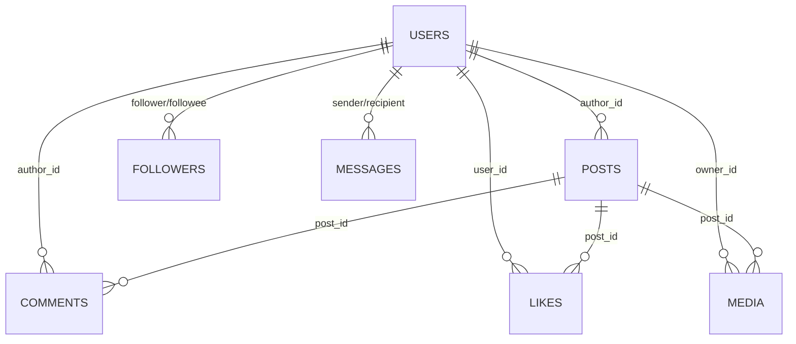

# Database Documentation

**Purpose:** Document the database schema for team reference.  
**DB Assumptions:** PostgreSQL 15+, UUID primary keys, `timestamptz`, optional Row Level Security (RLS).

---

## Overview of Database Architecture

The schema supports a social media application with core social and messaging features.

- **Users** – stores account information (auth root).
- **Posts** – post metadata (caption, timestamps, visibility).
- **Comments** – comments on posts.
- **Likes** – which user liked which post.
- **Followers** – directed “following” relationships between users.
- **Messages** – private direct messages between users.
- **Media** – media assets attached to posts or messages (image/video/text metadata).

**Design highlights**
- UUID primary keys; standardized timestamps (`created_at`, `updated_at`, optional `deleted_at` for soft-delete).
- Foreign keys with `ON DELETE CASCADE` to prevent orphan rows.
- Composite PKs on relationship tables (e.g., `likes`, `followers`) to enforce uniqueness.
- Enumerated domains via `CHECK` constraints (e.g., visibility, media kind).
- RLS-ready for user-owned resources (optional, can be enabled per table).

---

## Table-by-Table Documentation (It’s subject to change later.)

### 1. `users`
Stores account information for each user.

| Column         | Type       | Constraints                                                          | Description                       |
|----------------|------------|-----------------------------------------------------------------------|-----------------------------------|
| id             | uuid       | **PK**, `DEFAULT gen_random_uuid()`                                   | Global user id                    |
| email          | citext     | **UNIQUE**, **NOT NULL**                                              | Login identifier                  |
| username       | citext     | **UNIQUE**, **NOT NULL**                                              | Public handle                     |
| password_hash  | text       | **NOT NULL**                                                          | Hashed credential (Argon2/BCrypt) |
| status         | text       | `CHECK (status IN ('active','disabled'))`, `DEFAULT 'active'`         | Account state                     |
| created_at     | timestamptz| **NOT NULL**, `DEFAULT now()`                                         | Creation timestamp                |
| updated_at     | timestamptz| **NOT NULL**, `DEFAULT now()`                                         | Last update timestamp             |

---

### 2. `posts`
Handles posts caption, timestamp, and visibility (can be influenced by hashtag/location in app logic).

| Column         | Type       | Constraints                                                                 | Description                             |
|----------------|------------|------------------------------------------------------------------------------|-----------------------------------------|
| id             | uuid       | **PK**, `DEFAULT gen_random_uuid()`                                          | Post id                                 |
| author_id      | uuid       | **FK → users(id)** `ON DELETE CASCADE`, **NOT NULL**                         | Post owner                              |
| caption        | text       |                                                                              | Caption text (suggest ≤ 2200 chars)     |
| visibility     | text       | `CHECK (visibility IN ('public','followers','private'))`, `DEFAULT 'public'`| Who can view                            |
| location       | text       |                                                                              | Optional location string                |
| like_count     | int        | **NOT NULL**, `DEFAULT 0`                                                    | Cached likes (optional)                 |
| comment_count  | int        | **NOT NULL**, `DEFAULT 0`                                                    | Cached comments (optional)              |
| created_at     | timestamptz| **NOT NULL**, `DEFAULT now()`                                                | Creation time                           |
| updated_at     | timestamptz| **NOT NULL**, `DEFAULT now()`                                                | Update time                             |
| deleted_at     | timestamptz|                                                                              | Soft delete                             |

**Indexes (recommended):**  
- `(author_id, created_at DESC)` for profile feeds  
- `(visibility)` for RLS-friendly filtering and feed policies

---

### 3. `comments`
Stores comments written on posts (supports threaded replies via `parent_id`).

| Column     | Type       | Constraints                                             | Description           |
|------------|------------|----------------------------------------------------------|-----------------------|
| id         | uuid       | **PK**, `DEFAULT gen_random_uuid()`                      | Comment id            |
| post_id    | uuid       | **FK → posts(id)** `ON DELETE CASCADE`, **NOT NULL**     | Target post           |
| author_id  | uuid       | **FK → users(id)** `ON DELETE CASCADE`, **NOT NULL**     | Comment author        |
| content    | text       | **NOT NULL**                                             | Comment text          |
| parent_id  | uuid       | **FK → comments(id)**                                    | For threaded replies  |
| created_at | timestamptz| **NOT NULL**, `DEFAULT now()`                             | Creation time         |
| deleted_at | timestamptz|                                                          | Soft delete           |

**Index (recommended):** `(post_id, created_at)`

---

### 4. `likes`
Tracks which user liked which post.

| Column     | Type | Constraints                                              | Description |
|------------|------|-----------------------------------------------------------|-------------|
| post_id    | uuid | **FK → posts(id)** `ON DELETE CASCADE`, **PK (part)**     | Post liked  |
| user_id    | uuid | **FK → users(id)** `ON DELETE CASCADE`, **PK (part)**     | Liker       |
| created_at | timestamptz | `DEFAULT now()`                                    | When liked  |

**Composite PK:** `(post_id, user_id)` prevents duplicate likes.  
**Index (recommended):** `(post_id)` for counting/joins.

---

### 5. `followers`
Manages “following” relationships between users (directed graph: follower → followee).

| Column       | Type | Constraints                                                   | Description            |
|--------------|------|----------------------------------------------------------------|------------------------|
| follower_id  | uuid | **FK → users(id)** `ON DELETE CASCADE`, **PK (part)**          | The user who follows   |
| followee_id  | uuid | **FK → users(id)** `ON DELETE CASCADE`, **PK (part)**          | The user being followed|
| created_at   | timestamptz | `DEFAULT now()`                                         | Follow timestamp       |

**Constraints:**  
- **PK:** `(follower_id, followee_id)`  
- **CHECK:** `follower_id <> followee_id` to prevent self-follow  
**Index (recommended):** `(followee_id)` for building follower feeds.

---

### 6. `messages`
Handles private messages between users (simple direct model).

| Column       | Type       | Constraints                                             | Description              |
|--------------|------------|----------------------------------------------------------|--------------------------|
| id           | uuid       | **PK**, `DEFAULT gen_random_uuid()`                      | Message id               |
| sender_id    | uuid       | **FK → users(id)** `ON DELETE CASCADE`, **NOT NULL**     | Sender                   |
| recipient_id | uuid       | **FK → users(id)** `ON DELETE CASCADE`, **NOT NULL**     | Recipient                |
| content      | text       |                                                          | Message body text        |
| media_id     | uuid       | **FK → media(id)** `ON DELETE SET NULL`                  | Optional attachment      |
| created_at   | timestamptz| **NOT NULL**, `DEFAULT now()`                             | Sent time                |
| read_at      | timestamptz|                                                          | Read time                |

**Index (recommended):** `(sender_id, recipient_id, created_at DESC)`  
*(Can be extended to conversation-style schema later.)*

---

### 7. `media`
Stores user-created posts/media (text/image/video) metadata.

| Column       | Type       | Constraints                                                         | Description             |
|--------------|------------|----------------------------------------------------------------------|-------------------------|
| id           | uuid       | **PK**, `DEFAULT gen_random_uuid()`                                  | Media id                |
| owner_id     | uuid       | **FK → users(id)** `ON DELETE CASCADE`, **NOT NULL**                 | Uploader                |
| post_id      | uuid       | **FK → posts(id)** `ON DELETE CASCADE`                               | Linked post (nullable)  |
| kind         | text       | `CHECK (kind IN ('image','video','text'))`, **NOT NULL**             | Media type              |
| url          | text       | **NOT NULL**                                                         | Storage URL (S3/GCS)    |
| width        | int        |                                                                      | px (image/video)        |
| height       | int        |                                                                      | px (image/video)        |
| duration_ms  | int        |                                                                      | video duration          |
| created_at   | timestamptz| **NOT NULL**, `DEFAULT now()`                                        | Upload time             |

**Indexes (recommended):** `(post_id)`, `(owner_id)`

---

## Relationship Diagrams (ERD)

> When the XP-17 “backend-app-database-design” diagram is approved, embed/export it here.  
> For now, a generated diagram (Mermaid) is provided:


## Common Query Examples

### Get a user’s posts (newest first)
```sql
SELECT p.*
FROM posts p
WHERE p.author_id = $1
  AND p.deleted_at IS NULL
ORDER BY p.created_at DESC
LIMIT 50 OFFSET $2;
```
### Build a follower feed (followees’ posts)
```sql
SELECT p.*
FROM posts p
JOIN followers f ON f.followee_id = p.author_id
WHERE f.follower_id = $1
  AND p.deleted_at IS NULL
ORDER BY p.created_at DESC
LIMIT 50;
```
### Count likes on a post
```sql
SELECT COUNT(*) AS like_count
FROM likes
WHERE post_id = $1;
```

---

## RLS Policy Documentation

> If you enable RLS, set the current user id per session/transaction:  
> `SET app.current_user_id = '<uuid>';`

### Posts – SELECT visibility policy
```sql
ALTER TABLE posts ENABLE ROW LEVEL SECURITY;

CREATE POLICY posts_select_policy
ON posts FOR SELECT
USING (
  visibility = 'public'
  OR author_id = current_setting('app.current_user_id')::uuid
  OR (
    visibility = 'followers' AND EXISTS (
      SELECT 1 FROM followers
      WHERE follower_id = current_setting('app.current_user_id')::uuid
        AND followee_id = posts.author_id
    )
  )
);
```

### Posts – write policy (owner-only)
```sql
CREATE POLICY posts_write_own
ON posts FOR ALL
USING (author_id = current_setting('app.current_user_id')::uuid)
WITH CHECK (author_id = current_setting('app.current_user_id')::uuid);
```

### Messages – only sender/recipient can read
```sql
ALTER TABLE messages ENABLE ROW LEVEL SECURITY;

CREATE POLICY messages_select_self
ON messages FOR SELECT
USING (
  sender_id = current_setting('app.current_user_id')::uuid
  OR recipient_id = current_setting('app.current_user_id')::uuid
);
```

> Apply similar owner-scoped write policies to `comments`, `likes` (insert/delete by actor), and `media` (owner-only writes).

#### What they protect
- Prevents users from reading private posts or others’ DMs.  
- Ensures only owners can modify/delete their content.  
- Enforces follower-only visibility at the DB layer (not just app logic).

---

## Data Types and Constraints Reference

- **IDs**: `uuid` via `gen_random_uuid()`.  
- **Texts**: `text`, `citext` (case-insensitive) for `email`, `username`.  
- **Timestamps**: `timestamptz` with `DEFAULT now()`.  
- **Enumerations via CHECK**:  
  - `posts.visibility` in `('public','followers','private')`  
  - `media.kind` in `('image','video','text')`  
  - `users.status` in `('active','disabled')`  
- **Unique constraints**: `users.email`, `users.username`, composite PKs on `likes`, `followers`.  
- **FKs**: `ON DELETE CASCADE` for child rows (`comments`, `likes`, `media`) to avoid orphans.

---

## Troubleshooting Common Issues

- **RLS blocking reads** → ensure `SET app.current_user_id` is set; test with `EXPLAIN`.  
- **Duplicate like error** → composite PK violation (`23505`) should be treated as idempotent success in app.  
- **Slow feed queries** → verify indexes: `posts(author_id, created_at)`, `followers(follower_id, followee_id)`.  
- **FK delete errors** → prefer `ON DELETE CASCADE` or use soft-delete consistently.  
- **Full-text search missing** → add GIN index on captions if search is required (`to_tsvector`).